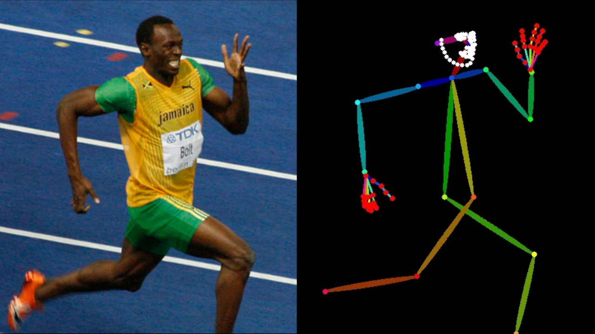

<div align="center">

# Dwpose Tensorrt ⚡

[](https://www.python.org/downloads/release/python-31012/)
[](https://developer.nvidia.com/cuda-downloads)
[](https://developer.nvidia.com/tensorrt)
[](https://www.apache.org/licenses/LICENSE-2.0)

</div>

<p align="center">
  
</p>

This repo provides a Tensorrt implementation of [Dwpose](https://github.com/IDEA-Research/DWPose) for ultra fast pose detection on images and videos

## ⏱️ Performance

| Device | FPS |
| :----: | :-: |
|  L40S  | 22  |

## 🚀 Installation

```bash
git clone https://github.com/yuvraj108c/Dwpose-Tensorrt
cd ./Dwpose-Tensorrt
pip install -r requirements.txt
```

## ☀️ Usage

1. Download the following onnx models into `models` folder:
   - [dw-ll_ucoco_384.onnx](https://huggingface.co/yzd-v/DWPose/resolve/main/dw-ll_ucoco_384.onnx)
   - [yolox_l.onnx](https://huggingface.co/yzd-v/DWPose/resolve/main/yolox_l.onnx)
2. Build tensorrt engines for both of these models by running:

   - `python export_trt.py`

3. Run the inference scripts to perform pose detection on images or videos
   - `python inference_image.py`
   - `python inference_video.py`

## 🤖 Environment tested

- Ubuntu 22.04 LTS, Cuda 12.4, Tensorrt 10.2.0.post1, Python 3.10, L40S GPU
- Windows (Not tested, but should work)

## 👏 Credits

- https://github.com/IDEA-Research/DWPose
- https://github.com/legraphista/dwpose-video

## License

Apache 2.0
